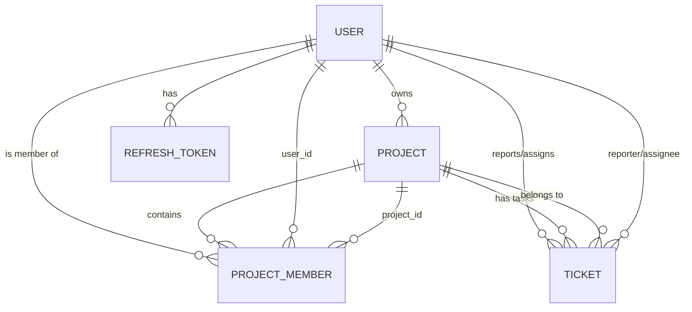

# 🏗️ Project Architecture & Module Flow

This document provides a comprehensive overview of the **Session-Based Task Tracker** architecture, module-wise flow, and database linkages.

---

## 📂 Project Structure & Module Purpose

The project is built using a **Spring Boot** backend with a **MySQL** database, following a modular architecture where each feature is encapsulated within its own package.

```text
src/main/java/com/rudra/sessionbased_task_tracker/
├── 🔑 auth/                # Authentication & Session Management
│   ├── controller/         # Login, Register, Refresh Token endpoints
│   ├── service/            # JWT generation, Password hashing, Token validation
│   └── entity/             # RefreshToken storage
├── 👥 user/                # User Profile Management
│   ├── entity/             # User (id, name, email, password_hash)
│   ├── repository/         # Database access for Users
│   └── service/            # User CRUD and lookup logic
├── 📂 project/             # Core Project Management
│   ├── entity/             # Project (key, name, description, owner_id)
│   ├── repository/         # Database access for Projects
│   └── service/            # Project lifecycle (Create, Archive, Update)
├── 🤝 projectMember/       # Project Access Control (RBAC)
│   ├── entity/             # ProjectMember (project_id, user_id, role)
│   └── service/            # Assigning users to projects with roles (ADMIN, MEMBER)
├── 🎫 ticket/              # Task/Issue Tracking
│   ├── entity/             # Ticket (project_id, reporter_id, assignee_id, status, priority)
│   └── service/            # Ticket lifecycle management within projects
├── 🛠️ Config/              # System Configuration
│   ├── SecurityConfig/     # JWT Filters, Path Authorizations, BCrypt
│   └── AppConfig/          # Bean definitions and general settings
├── ⚠️ Exception/           # Global Error Handling
│   └── GlobalExceptionHandler/ # Standardized error responses (e.g., 404, 401, 500)
└── 📦 common/              # Shared Resources
    └── dto/                # Reusable response objects (AuthResponse, ErrorResponse)
```

---

## 🔄 Module-Wise Flow

### 1. Authentication Flow
- **User Registration**: `AuthController` → `AuthService` → `UserRepository` (Save User with hashed password).
- **Login**: `AuthController` → `AuthService` (Validate credentials) → Generate **JWT Access Token** & **Refresh Token**.
- **Security**: Every subsequent request passes through `JwtAuthenticationFilter` to validate the token before reaching controllers.

### 2. Project Management Flow
- LoggedIn User creates a Project via `ProjectController`.
- The `ProjectService` assigns the creator as the **Owner**.
- Automatically, the owner is added as a **ProjectMember** with `ADMIN` role.

### 3. Member & Access Flow
- Project Owner adds other Users to the project via `ProjectMemberController`.
- This establishes the linkage needed for users to view or create tickets in that project.

### 4. Ticket/Task Lifecycle
- Users create Tickets within a Project via `TicketController`.
- **Logic Flow**: `TicketController` → `TicketService` (Validates project membership) → `TicketRepository`.
- Tickets track `reporter_id` (creator) and `assignee_id` (person working on it).

---

## 🗄️ Database Linkage (Entity Relationship)

The following describes how the database tables are connected:

- **`users`**: Central entity for all actions.
- **`projects`**: Every project has an `owner_id` linking back to `users.id`.
- **`project_members`**: A join table mapping `project_id` and `user_id`, defining which user can access which project and with what role.
- **`tickets`**: Links tasks to a `project_id`. Each ticket also has a `reporter_id` and an `assignee_id` mapping back to `users.id`.
- **`refresh_tokens`**: Stores session tokens for persistent login, linked via `user_id`.

### Entity Relationship Diagram (Conceptual)


---

## 🚀 Technical Connectivity

- **Service Communication**: Modules communicate via Service-to-Service calls (e.g., `TicketService` calls `ProjectMemberService` to verify permissions).
- **ORM**: JPA/Hibernate manages the relational mapping ensuring data integrity across the MySQL database.
- **Security Context**: The `Config` module extracts the `userId` from the JWT and injects it into the `SecurityContext`, making it globally available to the services.
